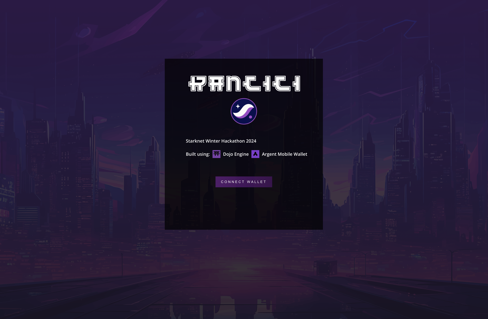
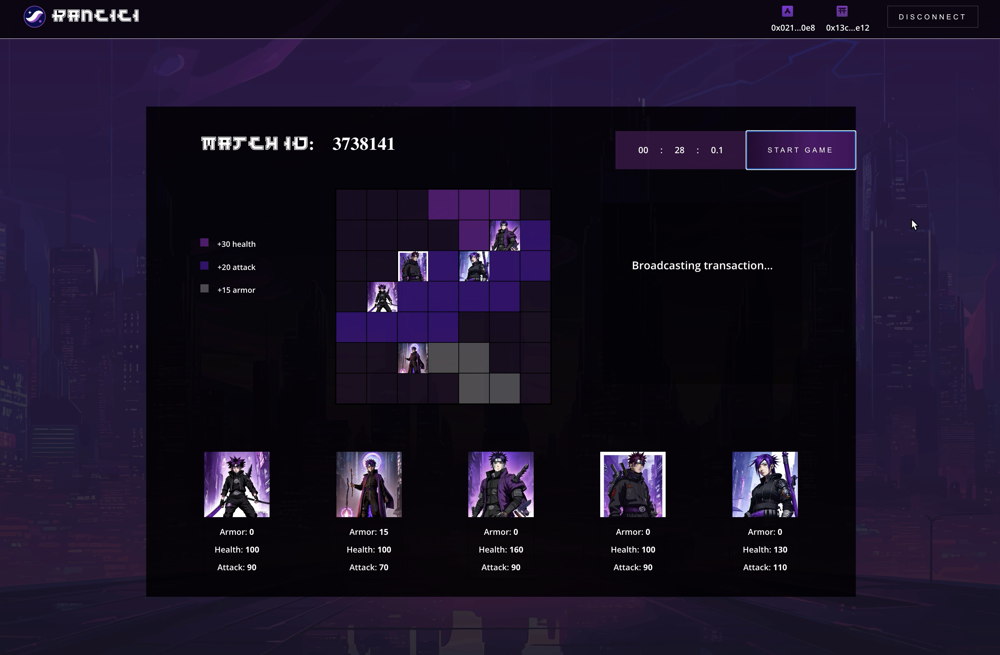
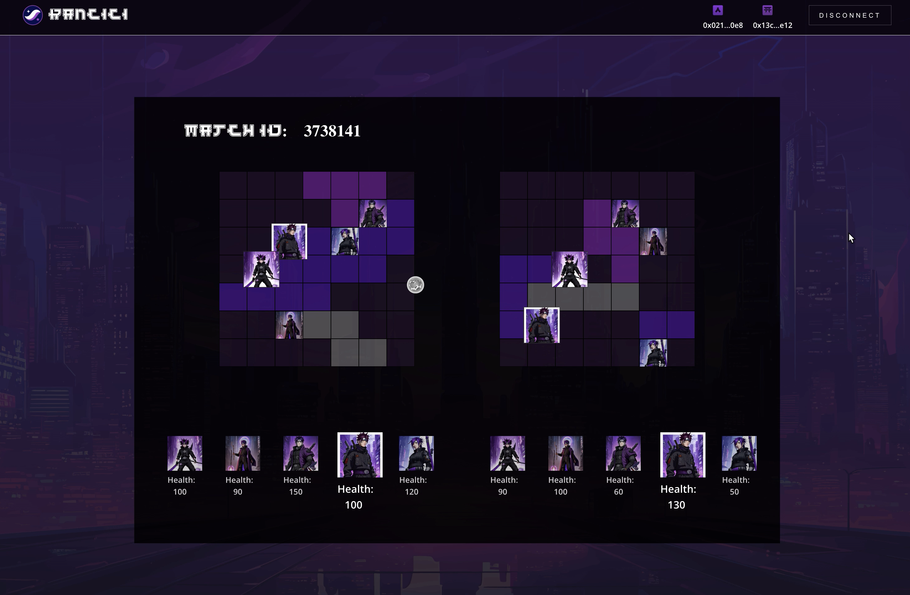

# Rancici: Starknet Winter Hackathon

## Overview

**Rancici** is an on-chain PvP battle game imagined in a **Futuristic Naruto Style**.

Players enter matches in which they get:

- Grid (7x7) on which 5 random characters from the Rancici Universe are placed
  - Where each character has: Health, Armor, and Attack statistic
- Different shapes (10) that have:
  - One of 3 effects (+30 Health, +20 Attack or +15 Armor) on character statistics
    - (If the shape occupies one of his adjacent cells)
  - These shapes can be rotated, but cannot overlap

**Goal of the Game** is to find the optimal positioning of the shapes, given the character placement, and the opponent they have encountered.

## Build Description

#### It has been built using:

- **Dojo Engine tooling** (Sozo, Katana, Torii, NPM package: Create Burner) for the Game's contract development/test/deployment and Front connection
- **Argent Mobile Wallet** as the primary user wallet

#### Deployed Contracts (Goerli Testnet)

- [Rancici World Contract](https://goerli.voyager.online/contract/0x04ebcc658b6fce7b61303e2137cdd8cab4e93728e0872ee0ba3be5432ee0b4fe)
- [Rancici Battle System (Actions) Contract](https://goerli.voyager.online/contract/0x117c911e19bc749a741066e1f210ce5673283ab2a745b2cd0ebfa237783448)

See [Contracts section](./contracts/README.md) for more information.

## Table of Contents

- [Detailed Game Flow](#detailed-game-flow)
- [Detailed Automatic Battle Rules](#detailed-automatic-battle-rules)
- [Installation](#installation)
  - [Contracts](./contracts/README.md)
  - [Client](./client/readme.md)
- [Usage](#usage)
- [Controls](#controls)
- [Further Directions](#further-directions)

## Detailed Game Flow

1. Player1 creates a match (open to everyone, or only to someone specific)
2. Player2 choses to join one of the available matches
3. Both players have a bounded time period in which they need to make shape placement decisions
4. Both players commit on-chain to the move they have made (to prevent one player making alternations when they see the opponent's move)
5. Both players reveal on-chain the move they have made
6. Automatic battle is carried out under clear rules defined in the contract, and the winner is decided on-chain

Bellow is an illustration of the view that is presented to players after they have been matched (Step 3):

## Detailed Automatic Battle Rules

Battle is run automatically where each players's first alive character attacks the first alive character of the other player in loop. Automatic battle is run until one of the players has no live characters left or 50 turns (each) are made, at which point player with most health (sum of all characters health) wins.

Snapshot of one battle visualisation (Player2.Character4 is attacking Player1.Character5)

## Features

PVP battle game with following features:

- Create battle (done by Player1)
- Join battle (done by Player2)
- Commit formation (Commitment stage - done by both players)
- Reveal formation (Reveal stage - done by both players)
- Start battle (Winner is decided in this call)

Create and join will be perfomed automatically by Madara in the upcoming future vesions.

## Usage

Check [contracts](./contracts/README.md) and [client](./client/readme.md) for more details.

## Controls

For Cli battle commands and controls look at [Battle Steps Commands](./contracts/README.md#battle-steps-commands-localy)

## Further Directions

Will include: Multiplayer mode, Multi-round matches, Community-driven tournaments and leagues, and much more...
