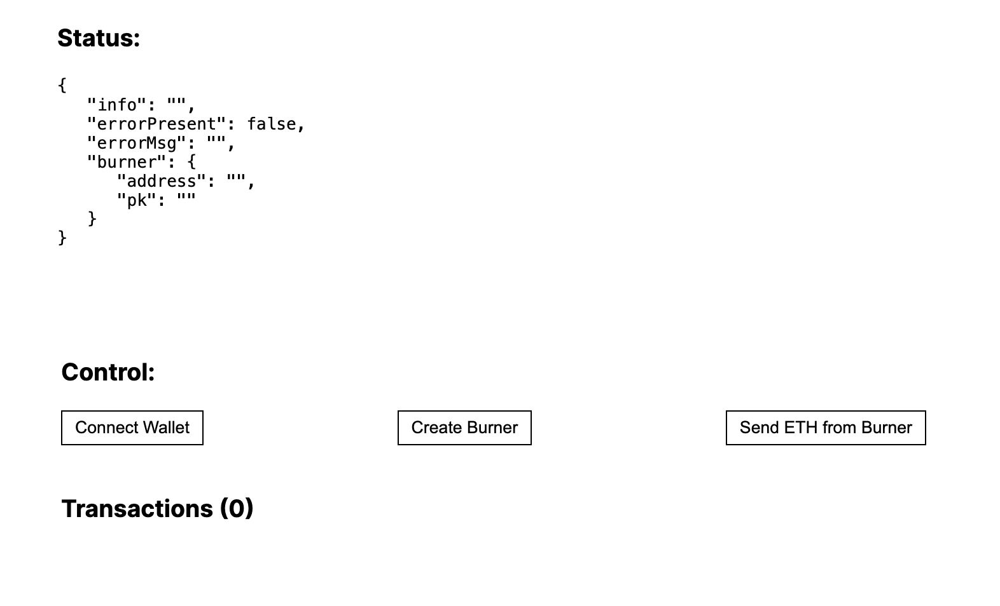

### PWA + Dojo.js + Argent Mobile example

Site can be installed as a PWA, and via WalletConnect authorized by user's Argent Mobile wallet.

Then a burner account is created (using Dojo.js) from which transactions can be sent.

**Note:** Burner's master account will need to be moved to Dapp's backend.

### Resources

PWA: https://github.com/dabit3/lens-pwa

Wallet Connect: https://docs.walletconnect.com/web3modal

Dojo.js: https://www.npmjs.com/package/@dojoengine/create-burner

### Flow

- **Status**: useful info.

- **Control**:

  - `Connect wallet` triggers WalletConnect flow (meant to be used for Argent mobile)
  - `Create Burner` creates a new Burner Account (failure possible)
  - `Send ETH from Burner` sends some ETH to master account from burner account (can be triggered multiple times)

- **Transactions** : list of txs from burner account
